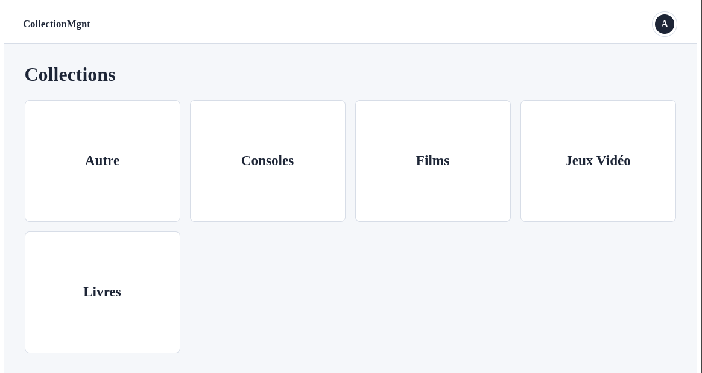
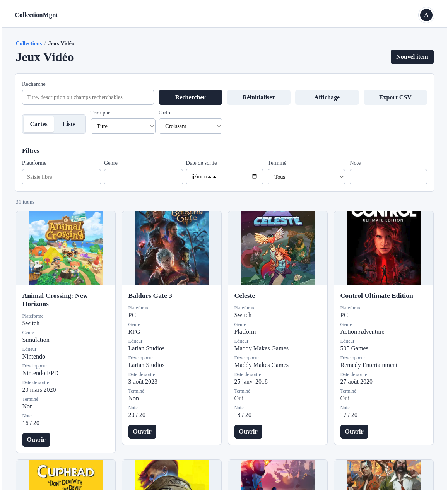
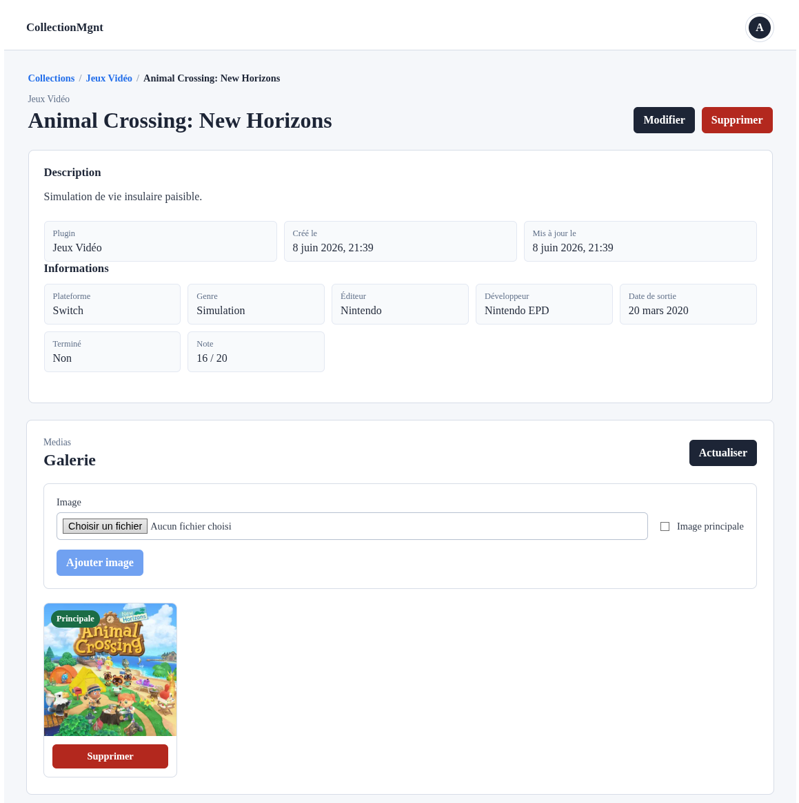
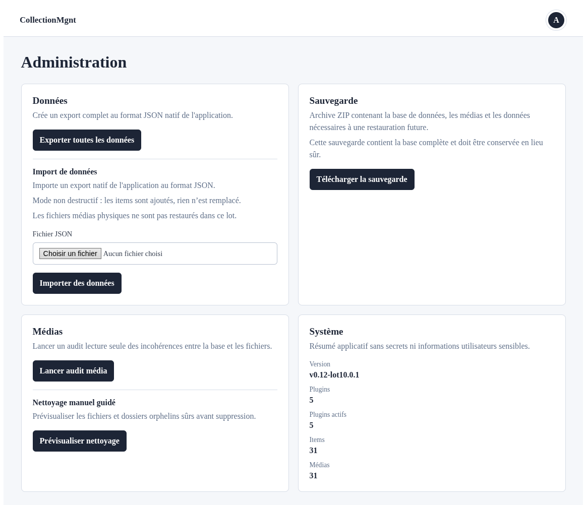

# CollectionMgnt

> 🇫🇷 La version française est présentée en premier.
>
> 🇬🇧 The English version is available further below in this document.

---

# Français

## Présentation

CollectionMgnt est une application web auto-hébergée de gestion de collections personnelles.

Le projet permet de gérer des collections de jeux vidéo, livres, films, consoles, jeux de société ou tout autre domaine modélisable par un plugin. Chaque plugin fournit un schéma de champs dynamique, ce qui permet d'adapter l'application à plusieurs types de collections sans réécrire le coeur applicatif.

Objectifs du projet :

- proposer une solution locale et indépendante des plateformes tierces ;
- gérer des collections variées avec des schémas déclaratifs ;
- offrir une interface simple pour consulter, rechercher, filtrer, trier et enrichir les items ;
- fournir des outils d'administration pour exporter, importer, auditer, nettoyer et sauvegarder les données.

Cas d'usage :

- inventaire personnel de jeux vidéo, livres, films, consoles ou jeux de société ;
- suivi de métadonnées propres à chaque type de collection ;
- gestion d'images associées aux items ;
- sauvegarde locale complète avant maintenance ou migration future.

## Fonctionnalités

- Plugins de collections déclaratifs.
- Schémas dynamiques avec champs `text`, `textarea`, `select`, `checkbox`, `date`, `number` et `rating`.
- CRUD items : création, consultation, modification et suppression.
- Recherche large sur titre, description et champs déclarés `searchable`.
- Filtres dynamiques sur les champs déclarés `filterable`.
- Tri configurable par titre, dates et champs metadata supportés.
- Vue cartes avec préférences d'affichage.
- Vue liste dense.
- Gestion média : upload d'images, fichier original, image optimisée WebP, miniature WebP, image principale et galerie.
- Administration protégée : données, sauvegarde, médias et système.
- Export JSON natif applicatif côté Administration.
- Export JSON natif par collection disponible via API.
- Export CSV utilisateur par collection.
- Import JSON natif non destructif en mode `add_only`.
- Audit média global en lecture seule.
- Nettoyage média manuel guidé des candidats disque sûrs.
- Sauvegarde ZIP complète téléchargeable.

## Dataset de démonstration

Un dataset officiel de démonstration est disponible dans [demo/README.md](demo/README.md).

Il contient 94 items répartis entre jeux vidéo, livres, films, consoles et objets divers. Il peut être importé depuis Administration > Importer des données.

## État du projet

Version actuelle : **v0.12-lot10.2.1**

Le projet est utilisable pour des collections réelles, mais reste en développement actif. Certaines fonctions avancées sont encore prévues, notamment la restauration ZIP guidée, les imports CSV avancés, la gestion utilisateur plus fine et l'amélioration des rapports d'administration.

Après connexion, l'utilisateur arrive directement sur `/collections`. Les routes authentifiées utilisent un layout global avec une barre supérieure persistante, la marque `CollectionMgnt` cliquable vers Collections et un menu utilisateur donnant accès à Administration, Mon compte (à venir) et Déconnexion. La route `/dashboard` reste disponible uniquement comme compatibilité et redirige vers `/collections`.

## Captures d'écran

### Collections



### Collection Jeux Vidéo



### Détail d'un item



### Administration



## Installation

### Prérequis

- Node.js 22 ou plus récent
- npm
- SQLite via `better-sqlite3`
- Git

### Cloner le dépôt

```bash
git clone https://github.com/jplayout/CollectionMgnt.git
cd CollectionMgnt
```

### Backend

```bash
cd backend
npm install
cd ..
```

### Frontend

```bash
cd frontend
npm install
cd ..
```

### Configuration `.env`

Créer un fichier `.env` à la racine du projet pour le backend :

```env
JWT_SECRET=change-me
ADMIN_USERNAME=admin
ADMIN_PASSWORD=change-me
```

Un fichier `frontend/.env` peut être utilisé si le frontend doit cibler une API différente :

```env
VITE_API_BASE_URL=http://localhost:3000
```

Ces fichiers sont locaux et ne doivent jamais être publiés.

### Lancement développement

Backend :

```bash
cd backend
npm run dev
```

Frontend, dans un autre terminal :

```bash
cd frontend
npm run dev
```

### Vérifications locales

Backend :

```bash
cd backend
npm run check:syntax
npm test
```

Frontend :

```bash
cd frontend
npm exec vite build
```

Qualité Git :

```bash
git diff --check
```

### Docker et images

Un déploiement local Docker/Podman est documenté dans `docs/deployment-docker.md`.

Des images prébuildées sont publiées sur GitHub Container Registry :

- `ghcr.io/jplayout/collectionmgnt-backend:latest`
- `ghcr.io/jplayout/collectionmgnt-frontend:latest`

## Architecture

### Frontend

- Vue 3
- Vue Router
- Pinia
- Vite
- Interface authentifiée avec layout global, collections, items, médias et administration

### Backend

- Node.js
- Fastify
- JWT
- `better-sqlite3`
- Sharp pour la validation et génération d'images
- Archiver pour les sauvegardes ZIP

### SQLite

La base locale contient les utilisateurs, plugins synchronisés, settings, items et métadonnées média. En développement, elle est stockée sous `backend/data/collection-manager.db` par défaut.

### Plugins

Les plugins sont chargés depuis `backend/plugins`. Ils définissent les collections disponibles, les champs dynamiques, les règles de validation et les capacités média.

Plugins inclus actuellement :

- jeux vidéo ;
- livres ;
- films ;
- consoles ;
- jeux de société.

## Sauvegarde

CollectionMgnt distingue deux formats.

### Export JSON métier

L'export JSON natif est un format métier portable et lisible. Il contient les plugins, schémas, settings non sensibles, collections, items et métadonnées média.

Il ne contient pas les fichiers médias physiques, les utilisateurs, les `password_hash`, les secrets ni les variables d'environnement. Il peut être réimporté partiellement via l'import JSON natif non destructif.

### Sauvegarde ZIP complète

La sauvegarde ZIP est un instantané technique complet généré via `GET /api/admin/backup.zip`.

Elle contient :

- `manifest.json` ;
- `database/collection-manager.db` ;
- `exports/application.json` ;
- `media/uploads/items/...` si des médias existent ;
- `plugins/...` si le dossier plugins est disponible.

La copie SQLite est créée de façon cohérente avant archivage. La sauvegarde ZIP ne fournit pas encore de restauration dans `v0.12-lot10.0.1`.

## Données locales et sécurité

Ne jamais publier :

- `.env` ;
- `frontend/.env` ;
- bases SQLite (`*.db`, `*.sqlite`, `*.sqlite3`) ;
- fichiers WAL/SHM SQLite ;
- uploads utilisateur (`backend/data/uploads/`) ;
- sauvegardes ZIP ;
- secrets, tokens, credentials externes ;
- logs applicatifs.

Les sauvegardes ZIP contiennent la base SQLite complète, y compris les utilisateurs et `password_hash`. Elles doivent être considérées comme sensibles et stockées dans un emplacement privé.

## Documentation

La documentation technique se trouve dans `docs/`.

Points d'entrée utiles :

- `docs/current-state.md`
- `docs/roadmap.md`
- `docs/administration.md`
- `docs/export-system.md`
- `docs/backup-zip.md`
- `docs/media-audit.md`
- `docs/media-cleanup.md`
- `docs/media-management.md`
- `docs/plugin-api.md`
- `docs/deployment-docker.md`

## Contribution

Les contributions passent par Pull Request. Voir [CONTRIBUTING.md](CONTRIBUTING.md).

## Licence

La licence du projet est une licence personnalisée non commerciale.

Consultez [LICENSE](LICENSE) pour le texte complet. L'usage commercial, la revente, l'offre en service hébergé ou l'intégration dans un produit commercial sont interdits sans autorisation écrite préalable.

---

# English

## Overview

CollectionMgnt is a self-hosted web application for managing personal collections.

It can manage video games, books, movies, consoles, board games, or any other domain that can be modeled through a plugin. Each plugin provides a dynamic field schema, allowing the application to support multiple collection types without rewriting the core application.

Project goals:

- provide a local solution independent from third-party platforms;
- manage varied collections through declarative schemas;
- offer a simple interface to browse, search, filter, sort and enrich items;
- provide administration tools for export, import, audit, cleanup and backup.

Use cases:

- personal inventory for games, books, movies, consoles or board games;
- tracking metadata specific to each collection type;
- managing images attached to items;
- creating a full local backup before maintenance or future migration.

## Features

- Declarative collection plugins.
- Dynamic schemas with `text`, `textarea`, `select`, `checkbox`, `date`, `number` and `rating` fields.
- Item CRUD: create, read, update and delete.
- Broad search on title, description and fields marked as `searchable`.
- Dynamic filters on fields marked as `filterable`.
- Configurable sorting by title, dates and supported metadata fields.
- Card view with display preferences.
- Dense list view.
- Media management: image upload, original file, optimized WebP image, WebP thumbnail, primary image and gallery.
- Protected administration page: data, backup, media and system sections.
- Native JSON export for the whole application from Administration.
- Native JSON export per collection available through the API.
- User CSV export per collection.
- Non-destructive native JSON import in `add_only` mode.
- Read-only global media audit.
- Guided manual media cleanup for safe filesystem candidates.
- Downloadable full ZIP backup.

## Demo Dataset

An official demo dataset is available in [demo/README.md](demo/README.md).

It contains 94 items across video games, books, movies, consoles and miscellaneous objects. It can be imported from Administration > Import data.

## Project Status

Current version: **v0.12-lot10.2.1**

The project is usable for real collections, but it is still under active development. Planned areas include guided ZIP restore, advanced CSV imports, finer user management and improved administration reports.

After login, users land directly on `/collections`. Authenticated routes use a global layout with a persistent top bar, the `CollectionMgnt` brand linking to Collections, and a user menu with Administration, a coming-soon account entry and sign out. The `/dashboard` route remains only as a compatibility redirect to `/collections`.

## Screenshots

### Collections


### Video Games Collection


### Item Details


### Administration


## Installation

### Requirements

- Node.js 22 or newer
- npm
- SQLite through `better-sqlite3`
- Git

### Clone the Repository

```bash
git clone https://github.com/jplayout/CollectionMgnt.git
cd CollectionMgnt
```

### Backend

```bash
cd backend
npm install
cd ..
```

### Frontend

```bash
cd frontend
npm install
cd ..
```

### `.env` Configuration

Create a root `.env` file for the backend:

```env
JWT_SECRET=change-me
ADMIN_USERNAME=admin
ADMIN_PASSWORD=change-me
```

A `frontend/.env` file can be used when the frontend must target a different API:

```env
VITE_API_BASE_URL=http://localhost:3000
```

These files are local and must never be published.

### Development Startup

Backend:

```bash
cd backend
npm run dev
```

Frontend, in another terminal:

```bash
cd frontend
npm run dev
```

### Docker and Images

Local Docker/Podman deployment is documented in `docs/deployment-docker.md`.

Prebuilt images are published on GitHub Container Registry:

- `ghcr.io/jplayout/collectionmgnt-backend:latest`
- `ghcr.io/jplayout/collectionmgnt-frontend:latest`

## Architecture

### Frontend

- Vue 3
- Vue Router
- Pinia
- Vite
- Authenticated interface with global layout, collections, items, media and administration pages

### Backend

- Node.js
- Fastify
- JWT
- `better-sqlite3`
- Sharp for image validation and generation
- Archiver for ZIP backups

### SQLite

The local database stores users, synchronized plugins, settings, items and media metadata. In development, it defaults to `backend/data/collection-manager.db`.

### Plugins

Plugins are loaded from `backend/plugins`. They define available collections, dynamic fields, validation rules and media capabilities.

Currently included plugins:

- video games;
- books;
- movies;
- consoles;
- board games.

## Backup

CollectionMgnt separates two formats.

### Business JSON Export

The native JSON export is a portable and readable business format. It contains plugins, schemas, non-sensitive settings, collections, items and media metadata.

It does not contain physical media files, users, `password_hash`, secrets or environment variables. It can be partially reimported through the non-destructive native JSON import.

### Full ZIP Backup

The ZIP backup is a full technical snapshot generated through `GET /api/admin/backup.zip`.

It contains:

- `manifest.json`;
- `database/collection-manager.db`;
- `exports/application.json`;
- `media/uploads/items/...` when media files exist;
- `plugins/...` when the plugins directory is available.

The SQLite copy is created consistently before archiving. ZIP restore is not implemented yet in `v0.12-lot10.0.1`.

## Local Data and Security

Never publish:

- `.env`;
- `frontend/.env`;
- SQLite databases (`*.db`, `*.sqlite`, `*.sqlite3`);
- SQLite WAL/SHM files;
- user uploads (`backend/data/uploads/`);
- ZIP backups;
- secrets, tokens, external credentials;
- application logs.

ZIP backups contain the full SQLite database, including users and `password_hash`. They must be treated as sensitive and stored privately.

## Documentation

Technical documentation is available in `docs/`.

Useful entry points:

- `docs/current-state.md`
- `docs/roadmap.md`
- `docs/administration.md`
- `docs/export-system.md`
- `docs/backup-zip.md`
- `docs/media-audit.md`
- `docs/media-cleanup.md`
- `docs/media-management.md`
- `docs/plugin-api.md`
- `docs/deployment-docker.md`

## Contributing

Contributions go through Pull Requests. See [CONTRIBUTING.md](CONTRIBUTING.md).

## License

This project uses a custom non-commercial license.

See [LICENSE](LICENSE) for the full text. Commercial use, resale, hosted-service offering or integration into a commercial product are prohibited without prior written permission.
